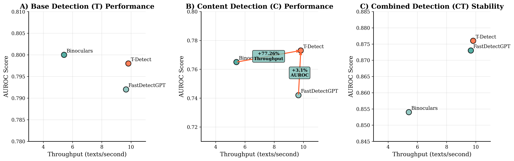

# T-Detect: Tail-Aware Statistical Normalization for Robust AI Text Detection



**T-Detect** is a novel zero-shot detector for machine-generated text that addresses fundamental statistical flaws in existing curvature-based methods. By replacing the standard Gaussian normalization with robust, theoretically-justified scoring based on the Student's t-distribution, T-Detect achieves superior resilience to statistical outliers characteristic of adversarial text.

## 🚀 Key Features

- **Heavy-tailed Statistical Foundation**: Uses Student's t-distribution normalization instead of flawed Gaussian assumptions
- **Adversarial Robustness**: Superior performance on adversarially crafted text (RAID benchmark)
- **Computational Efficiency**: 1.9% faster than baseline with 24x more stable execution time
- **Hyperparameter Robust**: Exceptional stability across parameter ranges
- **Multilingual Support**: Validated across diverse languages (English, Spanish, Arabic, Chinese, French)
- **Two-dimensional Detection**: Enhanced CT framework combining content and text dimensions

## 📊 Performance Highlights

| Method | RAID Overall AUROC | HART Level 3 AUROC | Speed Improvement |
|--------|-------------------|-------------------|------------------|
| CT(FastDetectGPT) | 0.854 | 0.876 | Baseline |
| CT(Binoculars) | 0.873 | 0.883 | 0.6x |
| **CT(T-Detect)** | **0.876** | **0.881** | **1.019x** |

## 🛠️ Installation

### Prerequisites
- Python 3.8+
- CUDA-capable GPU (recommended)
- 8GB+ RAM

### Setup
```bash
# Clone the repository
git clone https://github.com/your-org/t-detect.git
cd t-detect

# Install dependencies
pip install -r requirements.txt

# Download models (will be cached automatically on first run)
python -c "from scripts.detectors.model import load_model; load_model('tiiuae/falcon-7b', 'cuda')"
```

## 🎯 Quick Start

### Basic Usage

```python
from scripts.detectors import get_detector

# Initialize T-Detect
detector = get_detector('t_detect')

# Detect AI-generated text
text = "The rapid advancement of artificial intelligence..."
score = detector.compute_crit(text)
prediction = "AI-generated" if score > detector.threshold else "Human-written"

print(f"Detection score: {score:.4f}")
print(f"Prediction: {prediction}")
```

### Command Line Interface

```bash
# Run T-Detect on a single text file
python scripts/demo.py --text "Your text here" --detector t_detect

# Batch processing on dataset
python scripts/delegate_detector.py \
    --data_path ./benchmark/hart \
    --result_path ./results \
    --datasets essay.test \
    --detectors t_detect

# Two-dimensional detection (CT framework)
python scripts/delegate_detector.py \
    --data_path ./benchmark/hart \
    --result_path ./results \
    --datasets essay.test \
    --detectors "CT(t_detect)"
```

## 🧪 Reproduction Scripts

### Reproduce Main Results (HART Dataset)
```bash
# Run all HART experiments with T-Detect
./scripts/reproduce_hart.sh

# Run specific domains
python scripts/delegate_detector.py \
    --data_path ./benchmark/hart \
    --result_path ./exp_reproduction \
    --datasets essay.dev,essay.test,news.dev,news.test \
    --detectors t_detect,binoculars,fast_detect
```

### Reproduce Adversarial Results (RAID Dataset)
```bash
# Run RAID benchmark experiments
./scripts/reproduce_raid.sh

# Run specific RAID experiments
python scripts/delegate_detector.py \
    --data_path ./benchmark/raid \
    --result_path ./exp_raid_reproduction \
    --datasets raid.dev,raid.test \
    --detectors t_detect,CT\(t_detect\)
```

### Reproduce Multilingual Results
```bash
# Run multilingual experiments
./scripts/reproduce_multilingual.sh

# Run specific language
python scripts/delegate_detector.py \
    --data_path ./benchmark/hart \
    --result_path ./exp_multilingual \
    --datasets news-zh.dev,news-zh.test \
    --detectors t_detect
```

### Baseline Comparisons
```bash
# Run all baseline methods for comparison
./scripts/reproduce_baselines.sh

# Compare specific methods
python scripts/delegate_detector.py \
    --data_path ./benchmark/hart \
    --result_path ./exp_baselines \
    --datasets essay.test \
    --detectors fast_detect,binoculars,t_detect,glimpse
```

## 📁 Project Structure

```
t-detect/
├── scripts/
│   ├── detectors/
│   │   ├── t_detect.py              # Main T-Detect implementation
│   │   ├── fast_detect_gpt.py       # FastDetectGPT baseline
│   │   ├── binoculars.py           # Binoculars baseline
│   │   └── configs/                # Detector configurations
│   ├── delegate_detector.py        # Main detection pipeline
│   ├── demo.py                     # Demo script
│   └── utils.py                    # Utility functions
├── benchmark/
│   ├── hart/                       # HART dataset
│   └── raid/                       # RAID dataset
├── reproduction_scripts/           # Reproduction scripts
├── examples/                       # Example usage
└── requirements.txt
```

## 🔬 Methodology

### Core Algorithm

T-Detect improves upon FastDetectGPT by addressing its fundamental statistical flaw. While FastDetectGPT uses standard Gaussian normalization:

```
Standard Score = discrepancy / sqrt(variance)
```

T-Detect uses heavy-tailed normalization based on Student's t-distribution:

```
T-Detect Score = discrepancy / sqrt((ν/(ν-2)) * variance)
```

Where ν is the degrees of freedom parameter (default: 5).

### Key Insight

Adversarial texts exhibit **leptokurtosis** (heavy tails) in their detection score distributions, violating the Gaussian assumption of existing methods. T-Detect's t-distribution normalization naturally handles these statistical outliers.

## 📈 Benchmarks

### HART Dataset (General Detection)
- **Domains**: ArXiv, News, Essays, Creative Writing
- **Tasks**: 3 difficulty levels (basic, rephrased, humanized)
- **Metrics**: AUROC, F1-score, TPR@5%FPR

### RAID Dataset (Adversarial Detection)
- **Attacks**: 12 types including paraphrasing, character-level manipulation
- **Domains**: 8 diverse categories
- **Focus**: Robustness against evasion attempts

### Multilingual Evaluation
- **Languages**: English, Spanish, Arabic, Chinese, French
- **Dataset**: CC News translated/generated content
- **Analysis**: Cross-linguistic effectiveness

## 🎮 Demo

### Interactive Detection Demo
```bash
python scripts/demo.py --interactive
```

### Visualization Demo
```bash
# Generate detection score distributions
python scripts/demo.py --visualize --dataset raid.test

# Compare methods
python scripts/demo.py --compare --methods t_detect,fast_detect,binoculars
```

### Example Output
```
=== T-Detect Demo ===
Text: "The fundamental principles of quantum mechanics suggest..."
T-Detect Score: -1.247
FastDetect Score: -0.892
Prediction: Human-written (high confidence)

Statistical Properties:
- Kurtosis: 0.12 (normal distribution)
- Method robustness: T-Detect maintains stability
```

## ⚙️ Configuration

### Detector Configuration
```json
{
    "name": "t_detect",
    "scoring_model_name": "tiiuae/falcon-7b-instruct",
    "reference_model_name": "tiiuae/falcon-7b",
    "max_token_observed": 512,
    "nu": 5,
    "device": "cuda",
    "cache_dir": "./cache"
}
```

### Advanced Configuration
```python
# Custom degrees of freedom
detector = get_detector('t_detect', nu=3)  # More heavy-tailed

# Different model combinations
detector = get_detector('t_detect', 
                       scoring_model='microsoft/DialoGPT-large',
                       reference_model='gpt2')

# CPU-only mode
detector = get_detector('t_detect', device='cpu')
```

## 🧪 Experimental Results

### Main Performance (AUROC)

| Dataset | Domain | FastDetect | Binoculars | T-Detect | CT(T-Detect) |
|---------|--------|------------|------------|----------|--------------|
| HART | Essay | 0.877 | 0.879 | 0.883 | **0.907** |
| HART | News | 0.714 | 0.720 | 0.718 | **0.793** |
| RAID | Books | 0.852 | 0.889 | 0.884 | **0.926** |
| RAID | Poetry | 0.823 | 0.859 | 0.878 | **0.898** |


## 🔧 Troubleshooting

### Common Issues

1. **CUDA out of memory**
   ```bash
   # Use smaller batch size or CPU mode
   python scripts/demo.py --device cpu --batch_size 1
   ```

2. **Model download failures**
   ```bash
   # Set Hugging Face cache directory
   export HF_HOME=/path/to/large/disk/cache
   ```

3. **Tokenizer mismatch errors**
   - Ensure reference and scoring models use compatible tokenizers
   - Check model configurations in `scripts/detectors/configs/`

### Performance Optimization

```python
# Enable model caching
import os
os.environ['TRANSFORMERS_CACHE'] = './cache'

# Use mixed precision for speed
detector = get_detector('t_detect', fp16=True)

# Batch processing for efficiency
scores = detector.batch_compute(texts, batch_size=8)
```

## 📚 Citation

If you use T-Detect in your research, please cite:

```bibtex
@article{t-detect2025,
    title={T-Detect: Tail-Aware Statistical Normalization for Robust Detection of Adversarial Machine-Generated Text},
    author={[Authors]},
    year={2025},
    url={https://github.com/ResearAI/t-detect}
}
```

## 🤝 Contributing

We welcome contributions! Please see [CONTRIBUTING.md](CONTRIBUTING.md) for guidelines.

### Development Setup
```bash
# Install development dependencies
pip install -r requirements-dev.txt

# Run tests
python -m pytest tests/

# Format code
black scripts/
isort scripts/
```

## 📄 License

This project is licensed under the MIT License - see the [LICENSE](LICENSE) file for details.

## 🙏 Acknowledgments

- Built upon [FastDetectGPT](https://github.com/baoguangsheng/fast-detect-gpt)
- Utilizes the [RAID](https://github.com/liamdugan/raid) and [HART](https://github.com/xxx) datasets
- Inspired by robust statistics literature on heavy-tailed distributions

---

**Note**: This research is for defensive AI safety purposes. Please use responsibly and in accordance with applicable laws and ethical guidelines.
